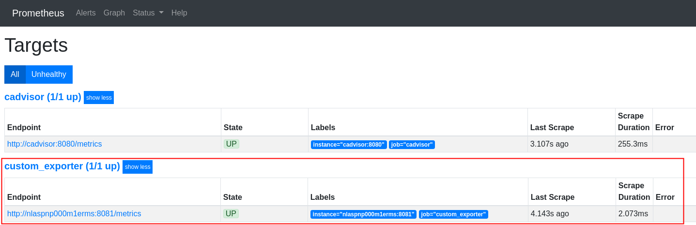
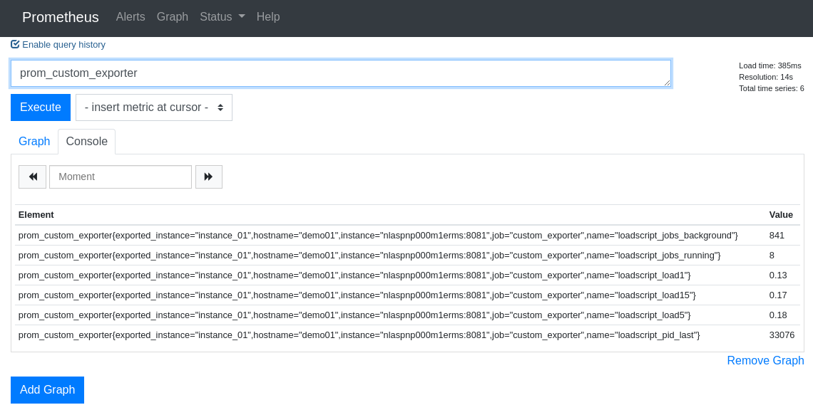

# go-custom-exporter

This package intends to provide a way to easily create Prometheus exporters from the output of any custom script/program without having to worry about doing much code.

## Dependencies

For this package to be successfully built, the following dependencies are required:

- [Prometheus/client_golang version 0.9.3 (2019-05-16)](https://github.com/prometheus/client_golang)

## Download

Download the binaries from the [latest release](https://github.ibm.com/fsilveir/go-custom-exporter/releases/latest) to your local machine and place it in your PATH and follow the instructions below for usage.


## Usage

In order to execute the script follow the example below:

```bash
$ prom_exporter -script <script_path> -port <port> -timeout <seconds>
```

For example:

```bash
$ prom_exporter -script /opt/my_script.sh -port 8080  -timeout 5
```

## Setting-up Your Own Scripts

Before using `prom_exporter` to export your own custom scripts, first you have to be sure you have a script/program/utility ready to return data in the required format as shown below:

```properties
system, subsystem, metric_name, metric_value
system, subsystem, metric_name, metric_value
system, subsystem, metric_name, metric_value

(...)
```

Consider the simple bash script below as an example, which should print the values from `/proc/loadavg` in the required format:

```bash
#!/bin/bash

function printMetric {
    SYSTEM=$1
    SUBSYSTEM=$2
    METRIC_NAME=$3
    METRIC_VALUE=$4
    echo "$SYSTEM $SUBSYSTEM $METRIC_NAME $METRIC_VALUE"
}

while read -r load1min load5min load15min jobs lastpid; do
    printMetric "demo01," "instance_01," "loadscript_load1," "$load1min"
    printMetric "demo01," "instance_01," "loadscript_load5," "$load5min"
    printMetric "demo01," "instance_01," "loadscript_load15," "$load15min"
    while IFS='/' read -r running background; do
        printMetric "demo01," "instance_01," "loadscript_jobs_running," "$running"
        printMetric "demo01," "instance_01," "loadscript_jobs_background," "$background"
    done <<< "$jobs"
    printMetric "demo01," "instance_01," "loadscript_pid_last," "$lastpid"
done < /proc/loadavg
```

The following output following is expected:

```bash
$ /opt/procloadavg.sh
demo01, loadscript_load1, instance_01, 1.62
demo01, loadscript_load5, instance_01, 1.40
demo01, loadscript_load15, instance_01, 1.52
demo01, loadscript_jobs_running, instance_01, 6
demo01, loadscript_jobs_background, instance_01, 1472
demo01, loadscript_pid_last, instance_01, 24586
```

Now execute the script with `prom_exporter` so that its data is ready to be scraped by Prometheus, try the following:


```bash
$ prom_exporter -script /opt/procloadavg.sh -port 8080
```

 Now when accessing the `http://localhost:8080/metrics` the following text should be presented as expected by Prometheus for the scraping to work:

 ```bash
$ curl -s localhost:8080/metrics | grep custom
# HELP prom_custom_exporter Prometheus Gauge Metrics from Custom script/command exporter
# TYPE prom_custom_exporter gauge
prom_custom_exporter{metric="loadscript_jobs_background",subsystem="instance_01",system="demo01"} 1498
prom_custom_exporter{metric="loadscript_jobs_running",subsystem="instance_01",system="demo01"} 9
prom_custom_exporter{metric="loadscript_load1",subsystem="instance_01",system="demo01"} 1.33
prom_custom_exporter{metric="loadscript_load15",subsystem="instance_01",system="demo01"} 1.29
prom_custom_exporter{metric="loadscript_load5",subsystem="instance_01",system="demo01"} 1.38
prom_custom_exporter{metric="loadscript_pid_last",subsystem="instance_01",system="demo01"} 15763
```

## Running Your Exporter as a Service with Systemd

1. Create the service file as shown below:

```bash
$ sudo touch /lib/systemd/system/prom_exporter_loadavg.service
```

2. Edit the service file with the following content:

```properties
[Unit]
Description=loadavg Prometheus Exporter

[Service]
Type=simple
Restart=always
RestartSec=5s
ExecStart=/usr/bin/prom_exporter -script /opt/procloadavg.sh -port 8080

[Install]
WantedBy=multi-user.target
```

3. Enable the new systemd service as shown:

```bash
$ sudo systemctl enable prom_exporter_loadavg.service
```

4. Restart your newly created service:

```bash
$ systemctl restart  prom_exporter_loadavg
```

## Prometheus Scraping Settings

Add the following to your `prometheus.yml` configuration file:

```yaml
  - job_name: 'custom_exporter'
    scrape_interval: 5s
    static_configs:
      - targets: ['<name_of_your_host>:<port_number>']
```

Restart the Prometheus Server, and verify at the Prometheus target list if the new job is listed as healthy, as shown below:

<table>
<tbody>
<tr>
<td></td>
</tr>
</tbody>
</table>


You can also confirm that data is being collected at the query page by searching for `prom_custom_exporter`, as shown below:

<table>
<tbody>
<tr>
<td></td>
</tr>
</tbody>
</table>


In order to get the full instructions on how to configure Prometheus to Scrape Your Custom Exporters follow the steps described at the following link from Prometheus official documentation:

- [FIRST STEPS WITH PROMETHEUS - Configuring Prometheus](https://prometheus.io/docs/introduction/first_steps/#configuring-prometheus)

## Building from Source

To build the binaries from source, execute the following (if you already have GOPATH configured on your local machine):

```bash
$ go get github.com/fsilveirgo-custom-exporter
```
Or clone the repository directly with the following command:

```bash
git clone git@github.com:fsilveir/go-custom-exporter.git
```

After succesfully downloading the files from the repository, execute the script `build.sh`, as shown below:

```bash
~/go/src/github.com/fsilveir/go-custom-exporter$ ./build.sh 
Revision is 1172888
Building GOOS=windows GOARCH=amd64...
Building GOOS=windows GOARCH=386...
Building GOOS=linux GOARCH=amd64...
Building GOOS=linux GOARCH=386...
Building GOOS=freebsd GOARCH=amd64...
Building GOOS=freebsd GOARCH=386...
Building GOOS=darwin GOARCH=amd64...
Building GOOS=darwin GOARCH=386...
prom_exporter_darwin_386: OK
prom_exporter_darwin_amd64: OK
prom_exporter_freebsd_386: OK
prom_exporter_freebsd_amd64: OK
prom_exporter_linux_386: OK
prom_exporter_linux_amd64: OK
prom_exporter_windows_386.exe: OK
prom_exporter_windows_amd64.exe: OK
```
